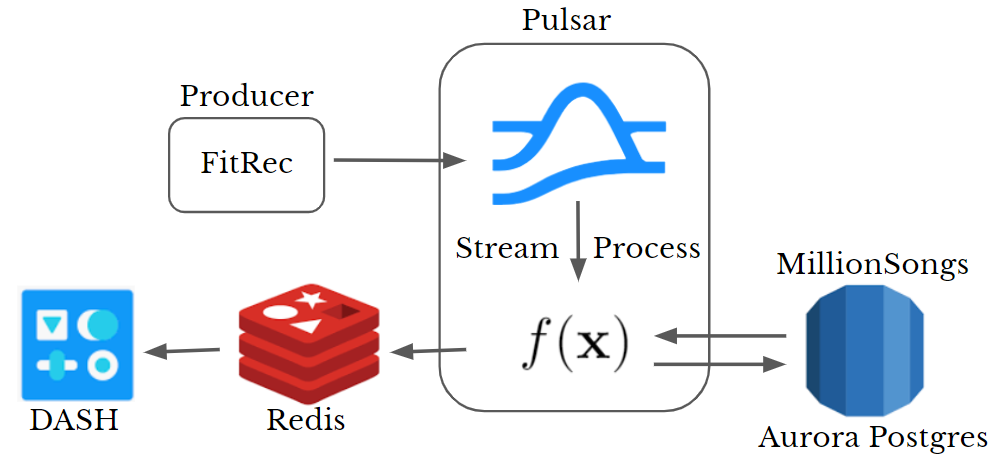

# TempoFit

A streaming pipeline to dynamically create playlists and improve workout quality.  

When working out, having the right playlist can turn a slog into a pleasure and a well-timed, energetic song can make pushing your limits easier. This projects aims to bring together real-time fitness trackers and music streaming services to craft custom playlists as users' workouts evolve. The pipeline ingests heaert-rate data and recommends songs whose tempo reflect the intensity of each user's workout as it happens. 

This platform aims to serve thousands of users working out simultaneously, processing incoming user information and delivering song recommendations with minimal latency. 

## Pipeline Structure  

A schematic of the pipeline is shown below  

Data ingestion is initiated by simulated producers which read from a CSV of workout data. Incoming user data is stream processed by a series of Pulsar functions - an in-cluster alternative to external stream processing engines. The first function tabulates a running average of the users heart rate over a configurable interval. The second function checks whether a user needs a new song pushed to their playlist by comparing the incoming timestamp to when their previous song will end. When necessary, a final function queries the song database and publishes the result of the query to Redis. The Redis store is accessible from a Dash web application.

## Repo Structure  

stream-simulate: Contains file to generate producers and publish workout data to Pulsar topics  
pulsar-functions: Python scripts which execute stream processing  
config: Pulsar function configuration files and bash scripts to create/delete functions  
dash: Plotly Dash web application 

## Data Sources  

The streaming heart rate data is from FitRec, a pulbicly available catalog of approximately 150k workouts. The data from each workout is labeled by a user ID, workout ID, sport, and user gender and consists of timestamped heart rates, and location.  

Song recommendation are generated by querying a copy of the MillionSong database, a conglomeration of song meta-data. In this project I read artist, title, song ID, duration, and tempo. The data set, however, includes many fields in addition to those relevant to this project.